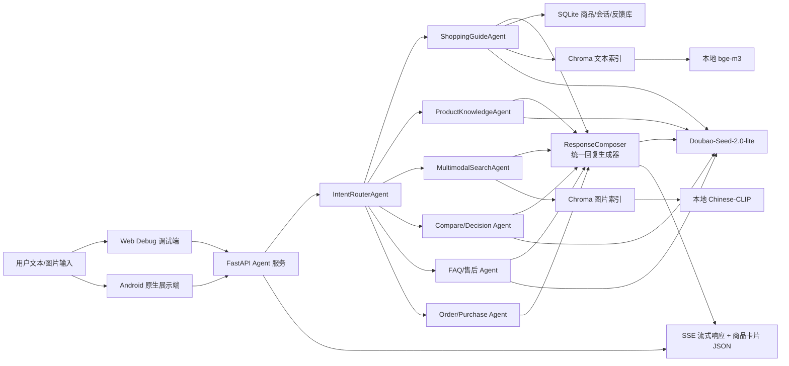

# 系统架构说明

当前工程按“调试端/移动端 -> FastAPI Agent 服务 -> 数据与索引 -> 大模型与本地向量模型”组织。

## 核心链路

1. 用户输入文本或图片。
2. FastAPI 接收请求，写入会话上下文。
3. IntentRouterAgent 判断任务类型。
4. 对导购类请求，系统先提取预算、品类、用途、人群、偏好等约束。
5. SQLite 做结构化约束过滤，Chroma 做语义召回，rerank 做最终排序。
6. 各业务 Agent 先产出事实、商品卡片、订单/FAQ/图搜结果和草稿回答。
7. ResponseComposer 统一调用 Doubao 改写用户可见回复，保持真人导购口吻；如果 LLM 失败，则保留业务模块 fallback。
8. SSE 返回文本流、商品卡片、trace、`feedback_enabled` 和最终完成事件。
9. 用户点赞/点踩写入反馈表，后续进入评测和 prompt/知识库迭代。

## 当前已实现能力

- Android 原生端：登录页、聊天页、侧边栏会话列表、新建会话、历史会话加载、真实删除会话、商品卡片、图片上传入口、赞踩反馈和 SSE 错误收尾。
- 后端会话接口：`GET /api/sessions`、`POST /api/sessions`、`GET /api/sessions/{id}/messages`、`DELETE /api/sessions/{id}`。
- 统一回复生成：`backend/app/agents/response_composer.py`，所有用户可见回答在返回前统一经过 ResponseComposer。
- 闲聊回复：`chitchat` 已从纯硬编码模板改为 Doubao 优先，失败才 fallback。
- 反馈显示规则：后端返回 `feedback_enabled`，Android 只在有效导购/FAQ/推荐回答下展示赞踩。
- 后端测试：已覆盖会话历史/删除、闲聊 LLM/fallback、ResponseComposer 和反馈显示规则。

## 设计边界

- Web Debug 是调试后台，保留 trace、raw SSE、会话 id、导入工具。
- Android 是正式展示端，重点是自然聊天、图片上传、商品卡片和反馈。
- ResponseComposer 是统一表达层，不负责检索、路由和业务决策；事实仍来自 SQLite、Chroma、订单工具、图搜和各业务 Agent。
- 本地模型权重放在 `models/`，不要混入 `backend/`。
- SQLite 和 Chroma 用于本地 MVP；后续可以替换成 MySQL/Postgres、Milvus/ES 等真实平台形态。
