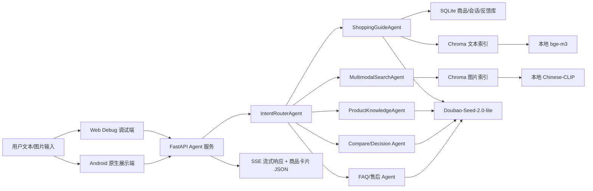

# 系统架构说明

当前工程按“调试端/移动端 -> FastAPI Agent 服务 -> 数据与索引 -> 大模型与本地向量模型”组织。

## 核心链路

1. 用户输入文本或图片。
2. FastAPI 接收请求，写入会话上下文。
3. IntentRouterAgent 判断任务类型。
4. 对导购类请求，系统先提取预算、品类、用途、人群、偏好等约束。
5. SQLite 做结构化约束过滤，Chroma 做语义召回，rerank 做最终排序。
6. LLM 只基于候选商品和用户约束生成回答。
7. SSE 返回文本流、商品卡片、trace 和最终完成事件。
8. 用户点赞/点踩写入反馈表，后续进入评测和 prompt/知识库迭代。

## 设计边界

- Web Debug 是调试后台，保留 trace、raw SSE、会话 id、导入工具。
- Android 是正式展示端，重点是自然聊天、图片上传、商品卡片和反馈。
- 本地模型权重放在 `models/`，不要混入 `backend/`。
- SQLite 和 Chroma 用于本地 MVP；后续可以替换成 MySQL/Postgres、Milvus/ES 等真实平台形态。
