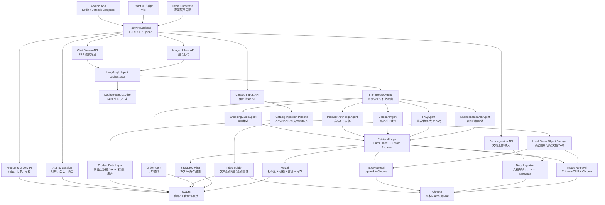
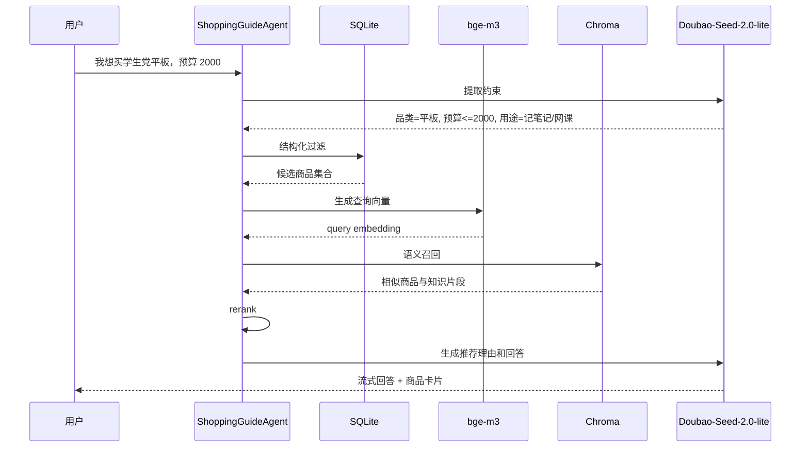
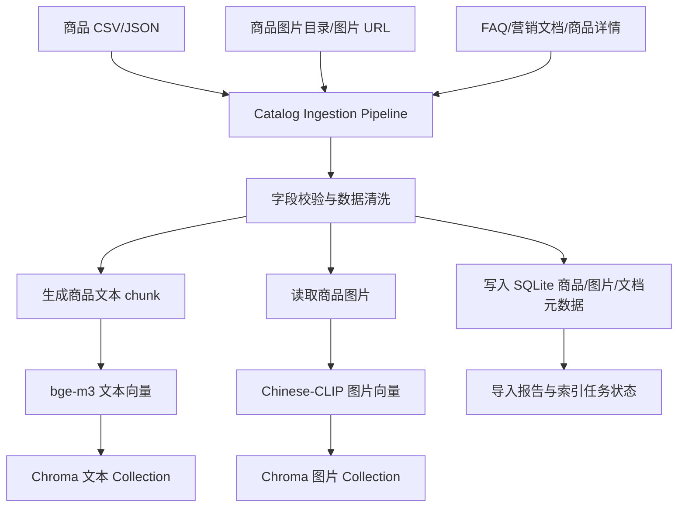
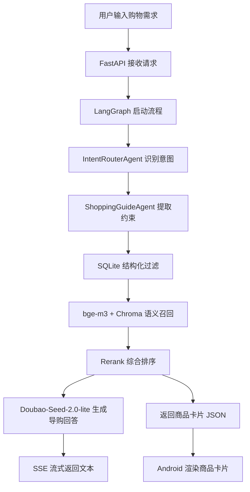
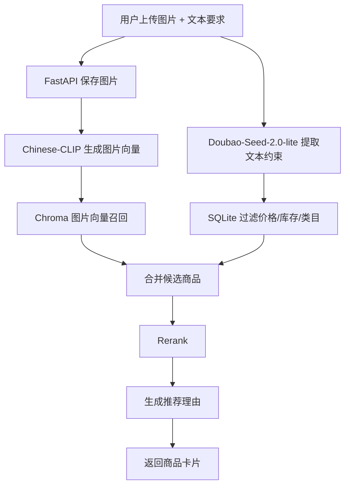
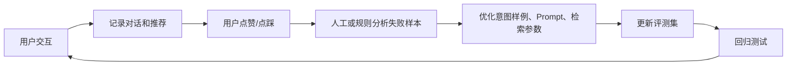

# 基于 RAG 的多模态电商智能导购 Agent

## 1. 项目名称

**基于 RAG 的多模态电商智能导购 Agent**

本项目面向电商导购场景，构建一个能够理解用户购物意图、检索商品知识、结合文本与图片输入进行推荐，并在移动端提供流式交互体验的智能导购系统。

## 2. 项目目标

系统目标是实现一个电商 AI 导购 Agent，支持用户通过文字或图片表达购物需求，系统能够结合商品详情、营销文档、FAQ 和商品图片进行检索与推理，最终给出专业、可信、个性化的导购建议。

核心能力包括：

1. 用户文字输入购物需求。
2. 用户上传图片查找相似商品。
3. 系统识别用户意图。
4. 系统检索商品详情、营销文档、FAQ 等知识库内容。
5. 基于 RAG 生成专业回答。
6. 返回商品卡片。
7. Android 端实现类似“豆包”的流式展示体验。
8. 支持用户点赞/点踩反馈。
9. 后端记录对话、检索、推荐和反馈数据。
10. 构建端到端质量评测与反馈闭环。

一句话概括：

> 用户像和真人导购聊天一样，说需求、发图片，系统通过 RAG 和多模态检索给出可信的商品推荐与决策建议。

## 3. 技术栈

| 层级 | 技术选型 | 说明 |
| --- | --- | --- |
| 调试前端 | React + Vite | 先用于调试后端、Agent 和商品卡片协议 |
| 路演展示端 | React / Android 可复用展示组件 | 用于项目路演，不展示调试 trace |
| 正式移动端 | Android Kotlin + Jetpack Compose | 正式展示端，承载聊天、图片上传、商品卡片和反馈 |
| API 后端 | Python FastAPI | 提供 HTTP API、SSE 流式接口、图片上传、商品/订单查询 |
| Agent 编排 | LangGraph | 负责意图路由、Agent 流程编排、状态流转 |
| RAG 框架 | LlamaIndex | 负责知识库索引、检索器封装、FAQ 与商品知识检索 |
| 文本大模型 | Doubao-Seed-2.0-lite | 负责意图理解、约束提取、推荐理由生成、对比决策 |
| 文本 Embedding | bge-m3 | 用于商品文本、FAQ、营销文档等中文/多语言语义检索 |
| 图片 Embedding | Chinese-CLIP | 用于商品图像向量化和看图找相似商品 |
| 向量数据库 | Chroma | 本地持久化向量库，存储文本向量和图片向量 |
| 结构化数据库 | SQLite | 存储商品、订单、会话、消息、检索记录和用户反馈 |
| 商品数据层 | 商品 CSV/JSON 导入 + 商品主数据模型 | 模拟真实电商商品中台，管理商品、SKU、价格、库存、标签、卖点和图片 |
| 图片与文件存储 | 本地文件目录，后期可替换对象存储/CDN | 存储商品图、用户上传图、营销文档、FAQ、商品详情文档 |
| 流式响应 | SSE | 支持 Android 端逐字/分块流式展示 |
| 部署方式 | 本地运行，后期 Docker Compose | 第一阶段降低部署复杂度，后期容器化 |

架构原则：

> FastAPI 管服务边界，LangGraph 管 Agent 流程，LlamaIndex 管 RAG 检索，SQLite 和 Chroma 管数据。

补充说明：LlamaIndex 作为检索封装层使用，底层向量存储仍采用 Chroma；文本 embedding 由 bge-m3 提供，图片 embedding 由 Chinese-CLIP 提供。

面向理想状态，系统还需要引入“真实电商平台简化版数据层”：使用商品导入管道模拟商品中台，使用本地文件目录模拟对象存储/CDN，使用索引构建任务将商品文本、知识文档和商品图片同步到 SQLite 与 Chroma，从而让 Agent 不依赖少量写死样例，而是面向可扩展的商品库和知识库工作。

## 4. 系统整体架构

系统采用移动端 + FastAPI 后端 + LangGraph Agent 服务 + RAG/多模态检索层 + 本地数据层的分层架构。



## 5. 核心模块设计

### 5.1 Android 客户端

Android 端是正式展示入口，重点体验是“像豆包一样的流式聊天 + 商品卡片 + 图片上传”。

主要功能：

1. 聊天消息输入。
2. SSE 流式接收模型回复。
3. 商品卡片渲染。
4. 图片上传与预览。
5. 点赞/点踩反馈。
6. 会话历史列表。
7. 商品详情跳转。

关键页面：

| 页面 | 功能 |
| --- | --- |
| 会话列表页 | 展示历史会话、创建新会话 |
| 聊天页 | 文本输入、图片上传、流式回答、商品卡片 |
| 商品详情页 | 展示商品参数、价格、库存、推荐理由 |
| 反馈入口 | 对回答、商品推荐结果进行点赞或点踩 |

### 5.2 React 调试后台

React 前端不作为正式用户端，主要用于调试后端能力。

主要功能：

1. 测试聊天接口。
2. 测试商品卡片 JSON 协议。
3. 测试图片上传与相似商品召回。
4. 查看检索结果、rerank 分数和 Agent 路由结果。

### 5.3 Demo Showcase 路演展示界面

路演展示界面用于项目路演，定位不同于 Web Debug。它不展示 trace、retrieved ids、raw SSE 等调试信息，而是以正式产品形态展示 AI 导购能力。

主要功能：

1. 类似“豆包”的聊天交互体验。
2. 支持文本输入和图片上传。
3. 流式展示导购回答。
4. 实时渲染商品卡片。
5. 展示推荐理由、价格、评分、销量、库存状态。
6. 支持点赞/点踩反馈。

界面原则：

1. 面向项目路演场景。
2. 突出“智能导购产品”的真实体验。
3. 隐藏工程调试信息。
4. 与 Web Debug 复用 API client、SSE parser、商品卡片协议、上传和反馈接口。

### 5.4 商品数据层与导入管道

真实电商平台的数据量和图片规模很大，系统不能依赖少量写死商品。理想状态下，本项目应构建一个“真实平台简化版数据层”，用来模拟商品中台、图片存储、知识库导入和索引构建流程。

核心职责：

1. 商品主数据管理：商品 ID、标题、类目、品牌、价格、库存、销量、评分、SKU、规格参数。
2. 商品内容管理：商品详情、卖点、适用人群、使用场景、标签、营销话术。
3. 图片管理：主图、详情图、用户上传图、图片 URL、本地路径、主图标记。
4. 文档管理：FAQ、售后政策、营销活动、商品补充资料、导购话术。
5. 索引构建：将结构化商品写入 SQLite，将文本和图片写入 Chroma。

推荐导入能力：

| 导入对象 | 格式 | 写入位置 | 用途 |
| --- | --- | --- | --- |
| 商品主数据 | `.csv` / `.json` | SQLite `products` | 结构化过滤和商品卡片 |
| 商品图片 | 本地目录 / URL 清单 | 本地文件或对象存储，SQLite `product_images` | 商品卡片展示和图片向量检索 |
| 商品详情 | `.md` / `.txt` / `.csv` | Chroma `product_text` / `knowledge_docs` | 商品知识 RAG |
| FAQ/售后政策 | `.md` / `.txt` | Chroma `faq` | FAQAgent 回答 |
| 营销文档 | `.md` / `.txt` / `.csv` | Chroma `marketing_docs` / `knowledge_docs` | 推荐理由和活动解释 |

离线数据流：

```text
商品 CSV/JSON + 商品图片 + FAQ/营销文档
  -> 数据清洗与字段校验
  -> 写入 SQLite 商品表/图片表/文档表
  -> 生成商品文本 chunk
  -> bge-m3 生成文本向量
  -> Chinese-CLIP 生成图片向量
  -> 写入 Chroma collection
  -> Agent 在线检索与推荐
```

### 5.5 FastAPI 后端服务

FastAPI 是系统的统一服务入口。

主要职责：

1. 提供聊天 SSE 接口。
2. 提供图片上传接口。
3. 提供非结构化文档上传/导入接口。
4. 提供商品、订单、会话、反馈 API。
5. 管理用户会话和消息持久化。
6. 调用 LangGraph Agent 编排服务。
7. 记录每次检索、推荐、反馈和错误日志。

建议接口：

| 接口 | 方法 | 说明 |
| --- | --- | --- |
| `/api/chat/stream` | POST | 发起聊天，返回 SSE 流 |
| `/api/upload/image` | POST | 上传图片，返回 `upload_id`、图片预览 URL 和本地存储路径 |
| `/api/docs/ingest` | POST | 上传或导入 `.md`、`.txt`、`.csv` 文档，写入专属知识库 |
| `/api/catalog/import` | POST | 批量导入商品 CSV/JSON，写入商品主数据 |
| `/api/catalog/reindex` | POST | 重建商品文本、知识文档和商品图片向量索引 |
| `/api/products` | GET | 商品列表和过滤查询 |
| `/api/products/{id}` | GET | 商品详情 |
| `/api/orders/{id}` | GET | 查询订单状态 |
| `/api/sessions` | GET/POST | 会话列表与新建会话 |
| `/api/feedback` | POST | 点赞、点踩、反馈原因 |
| `/api/debug/retrieval` | POST | 调试检索链路 |

### 5.6 LangGraph Agent 编排层

LangGraph 负责把用户请求编排成可控的 Agent 流程。它不直接负责向量检索细节，而是调用检索层和工具层。

核心 Agent：

| Agent | 作用 |
| --- | --- |
| `IntentRouterAgent` | 判断用户意图，分发到对应任务 |
| `ShoppingGuideAgent` | 处理“帮我推荐”“我想买”类导购需求 |
| `ProductKnowledgeAgent` | 回答商品参数、功能、材质、适用场景 |
| `CompareAgent` | 对比多个商品，输出差异和购买建议 |
| `FAQAgent` | 回答退货、物流、支付、售后等问题 |
| `OrderAgent` | 查询订单、物流、退货进度 |
| `MultimodalSearchAgent` | 处理图片输入和“看图找类似款”需求 |
| `ChitchatAgent` | 处理轻量闲聊，但保持导购身份 |

意图类型：

| 用户输入 | 路由目标 |
| --- | --- |
| “帮我推荐 500 元以内的耳机” | `ShoppingGuideAgent` |
| “这个产品防水吗？” | `ProductKnowledgeAgent` |
| “这两个哪个好？” | `CompareAgent` |
| “退货政策是什么？” | `FAQAgent` |
| “我订单到哪了？” | `OrderAgent` |
| “看图找类似款” | `MultimodalSearchAgent` |
| “我想送女朋友礼物” | `ShoppingGuideAgent` |
| “你好” | `ChitchatAgent` |

### 5.7 RAG 检索层

RAG 检索层由 LlamaIndex、bge-m3、Chroma 和 SQLite 组成。

文本知识来源：

1. 商品标题。
2. 商品详情。
3. 商品参数。
4. 商品评价摘要。
5. 营销文档。
6. FAQ 文档。
7. 售后政策。

### 5.7.1 非结构化文档上传/导入

系统支持通过上传非结构化文档构建专属知识库。第一版支持 `.md`、`.txt`、`.csv`，用于导入商品详情补充资料、营销文档、活动说明、FAQ 和导购话术；后续可扩展 PDF、Word、Excel 和 HTML 页面。

文档导入流程：

```text
上传/导入文档
  -> 解析文本
  -> chunk 切分
  -> metadata 标注
  -> bge-m3 embedding
  -> 写入 Chroma
  -> RAG 检索时参与召回
```

建议新增 Chroma collection：

| Collection | 内容 | Embedding 模型 |
| --- | --- | --- |
| `knowledge_docs` | 上传的营销文档、导购话术、活动说明、商品补充资料 | bge-m3 |

metadata 示例：

```json
{
  "doc_type": "marketing",
  "source_file": "spring-sale.md",
  "category": "tablet",
  "version": "2026-05-19"
}
```

文本检索流程：



### 5.8 多模态图片检索层

图片检索使用 Chinese-CLIP 对商品图片和用户上传图片进行向量化。

图片检索流程：

1. 离线处理商品图片，生成 Chinese-CLIP 图片向量。
2. 将商品图片向量写入 Chroma。
3. 用户上传图片。
4. 系统生成上传图片 embedding。
5. 在 Chroma 中召回相似图片商品。
6. 如果用户同时输入文本约束，则提取价格、场景、品牌、颜色等条件。
7. 使用 SQLite 做结构化过滤。
8. 综合图片相似度、文本匹配度、价格、销量、评分、库存进行 rerank。
9. 返回商品卡片和推荐理由。

示例：

```text
用户：找类似这双鞋，但价格 300 以内，适合通勤

系统处理：
1. 图片检索：召回外观相似鞋款
2. 文本约束：价格 <= 300，场景 = 通勤
3. 结构化过滤：库存、价格、类目
4. 综合排序：图片相似度、舒适度、销量、评价
5. 返回：商品卡片 + 推荐理由
```

### 5.9 商品卡片协议

商品卡片必须由后端返回结构化 JSON，移动端只负责渲染，不让大模型自由拼 UI。

建议协议：

```json
{
  "type": "product_cards",
  "cards": [
    {
      "product_id": "p001",
      "title": "荣耀平板 X",
      "subtitle": "适合学生记笔记和网课",
      "price": 1899,
      "original_price": 2199,
      "image_url": "/static/products/p001.jpg",
      "rating": 4.7,
      "sales": 3821,
      "stock_status": "in_stock",
      "reasons": [
        "预算 2000 元以内",
        "屏幕尺寸适合网课",
        "支持手写笔记"
      ],
      "score": 0.91
    }
  ]
}
```

SSE 流中可以同时发送文本事件和卡片事件：

```text
event: message
data: {"delta":"我为你筛选了 3 款适合学生党的平板。"}

event: product_cards
data: {"cards":[...]}

event: done
data: {"status":"ok"}
```

## 6. 数据库设计

### 6.1 SQLite 表设计

建议第一阶段使用 SQLite，后期可以迁移到 PostgreSQL。

核心表：

| 表名 | 说明 |
| --- | --- |
| `users` | 用户信息 |
| `sessions` | 会话信息 |
| `messages` | 聊天消息 |
| `products` | 商品主数据，包括标题、类目、品牌、价格、库存、评分、销量、详情摘要 |
| `product_skus` | 商品 SKU、规格组合、颜色、尺码、版本、SKU 价格和库存 |
| `product_attributes` | 商品属性键值对，例如重量、材质、防水等级、屏幕尺寸、续航 |
| `product_tags` | 商品标签，例如学生党、通勤、送礼、性价比、轻便、护眼 |
| `product_images` | SQLite 商品图片表，记录商品图片路径、主图标记和商品关联 |
| `documents` | 上传/导入的知识库文档元数据 |
| `orders` | 订单数据 |
| `retrieval_logs` | 检索记录 |
| `recommendation_logs` | 推荐结果记录 |
| `feedback` | 点赞/点踩反馈 |
| `evaluation_cases` | 评测用例 |
| `import_jobs` | 商品、图片、文档批量导入任务和执行状态 |
| `index_jobs` | 文本索引、图片索引重建任务和执行状态 |

### 6.2 Chroma Collection 设计

| Collection | 内容 | Embedding 模型 |
| --- | --- | --- |
| `product_text` | 商品标题、详情、参数、卖点 | bge-m3 |
| `faq` | 售后、物流、退货、支付 FAQ | bge-m3 |
| `marketing_docs` | 营销文档、活动说明 | bge-m3 |
| `knowledge_docs` | 用户上传/导入的非结构化知识库文档 | bge-m3 |
| `product_images` | Chroma 商品图片向量 collection | Chinese-CLIP |

### 6.3 商品数据导入与索引重建策略

真实平台的商品数据通常来自商品中台、商家后台、运营系统和供应链系统。为了在本项目中模拟这一过程，系统应提供可重复执行的数据导入和索引重建能力。

数据导入原则：

1. 商品主数据以 CSV/JSON 为主要导入格式，便于批量扩充样品库。
2. 商品图片可以先使用本地文件目录，后期替换为对象存储或 CDN URL。
3. 商品详情、FAQ、营销文档等非结构化内容进入文档导入流程。
4. 导入任务需要记录成功数、失败数、错误原因和导入版本。
5. 商品数据更新后，应支持重建文本索引和图片索引。

索引重建对象：

| 索引任务 | 输入 | 输出 |
| --- | --- | --- |
| 商品文本索引 | 商品标题、描述、参数、卖点、标签 | Chroma `product_text` |
| 文档知识索引 | FAQ、营销文档、商品补充资料 | Chroma `faq` / `knowledge_docs` |
| 商品图片索引 | 商品主图、详情图、本地图片或 CDN 图片 | Chroma `product_images` |

理想状态下，系统可以通过一个命令或接口完成：

```text
导入商品数据 -> 校验字段 -> 写 SQLite -> 写文件/图片元数据 -> 重建 Chroma 索引 -> 输出导入报告
```

## 7. 端到端业务流程

### 7.0 商品数据导入与索引构建



### 7.1 文本导购推荐



### 7.2 图片找同款



## 8. 质量评测与反馈闭环

系统需要记录用户行为和模型输出，用于持续优化。

记录数据：

1. 用户原始问题。
2. 用户上传图片 ID。
3. 意图识别结果。
4. 提取出的购物约束。
5. 召回商品列表。
6. rerank 分数。
7. 最终推荐商品。
8. 生成回答。
9. 用户点赞/点踩。
10. 用户是否点击商品卡片。
11. 多轮对话中的约束继承结果。
12. 商品数据导入版本、索引版本和召回所用 collection。

评测指标：

| 指标 | 说明 |
| --- | --- |
| 意图识别准确率 | 路由是否正确 |
| 检索召回率 | 是否召回相关商品或知识 |
| 推荐相关性 | 推荐商品是否满足用户需求 |
| 回答可信度 | 是否基于检索内容回答 |
| 商品卡片点击率 | 用户是否对推荐感兴趣 |
| 点赞率 | 用户对回答质量的显式反馈 |
| 图片相似检索准确率 | 看图找类似款是否匹配外观 |
| 多轮约束继承准确率 | 追问场景下是否继承上一轮预算、品类、用途、偏好等约束 |
| 多轮推荐一致性 | 后续推荐是否与前文需求保持一致 |
| 商品数据覆盖率 | 样品库是否覆盖主要类目、价格带、使用场景和人群 |
| 图片资产覆盖率 | 商品是否具备可用于卡片展示和图片检索的主图 |
| 索引新鲜度 | 商品或文档更新后，Chroma 索引是否及时重建 |

反馈闭环：



## 9. 错误处理与降级策略

| 场景 | 降级策略 |
| --- | --- |
| Doubao-Seed-2.0-lite 超时 | 返回检索结果摘要，提示用户稍后重试 |
| Chroma 检索失败 | 退回 SQLite 关键词过滤 |
| 图片向量生成失败 | 提示重新上传图片，并允许转文本搜索 |
| 没有找到商品 | 引导用户放宽预算、品牌、品类等条件 |
| 意图识别不确定 | 追问用户澄清需求 |
| SSE 中断 | Android 端允许重新生成或恢复会话 |

## 10. 项目实施阶段

### 第一阶段：后端 MVP + 基础 Agent 编排

目标：跑通文本导购主链路，形成可演示的最小闭环。

内容：

1. 搭建 FastAPI。
2. 建立 SQLite 商品表、会话表、消息表。
3. 接入 Doubao-Seed-2.0-lite。
4. 接入 bge-m3 文本 embedding 接口。
5. 建立 Chroma 文本向量库。
6. 实现 `.md`、`.txt`、`.csv` 文档导入，构建 `knowledge_docs` 专属知识库。
7. 实现 `IntentRouterAgent`、`ShoppingGuideAgent`、`FAQAgent` 和 `ChitchatAgent`。
8. 实现会话记忆，保存预算、品类、用途、偏好等多轮约束。
9. 实现 `/api/chat/stream` SSE 接口。
10. 返回文本回答和商品卡片 JSON。
11. 建立 React Web Debug 调试台，用于验证 SSE、Agent trace、商品卡片、图片上传和文档导入。

### 第二阶段：真实平台简化数据层

目标：让系统从少量静态样品，升级为可导入、可扩展、可重建索引的商品数据平台简化版。

内容：

1. 设计商品 CSV/JSON 导入模板。
2. 扩展商品字段：SKU、规格、属性、标签、适用人群、使用场景、卖点、库存、图片 URL。
3. 实现商品批量导入接口或脚本。
4. 实现商品图片目录/URL 管理，支持主图和多图。
5. 实现 FAQ、营销文档、商品详情文档的批量导入。
6. 实现一键重建 SQLite + Chroma 索引流程。
7. 记录导入任务、索引任务、失败原因和导入报告。
8. 将样品库从 20 条扩展到 100-300 条，覆盖多个类目、价格带和使用场景。

### 第三阶段：真实 bge-m3 文本 RAG 接入

目标：提升文本检索、FAQ 检索、营销文档检索和商品知识问答的真实语义能力。

内容：

1. 接入真实 bge-m3 模型。
2. 为商品标题、描述、参数、卖点、标签生成文本向量。
3. 为 FAQ、营销文档、商品详情文档生成 chunk embedding。
4. 建立或重建 `product_text`、`faq`、`marketing_docs`、`knowledge_docs` collection。
5. 优化文本召回策略：结构化过滤 + 向量召回 + 关键词兜底。
6. 调整 Prompt，使回答严格基于检索结果和商品数据生成。

### 第四阶段：真实 Chinese-CLIP 多模态图搜

目标：实现真正可用的“看图找类似款”能力。

内容：

1. 接入真实 bge-m3 模型。
2. 为商品主图和详情图生成图片向量。
3. 建立 `product_images` Chroma collection。
4. 实现用户上传图片 embedding。
5. 实现图片相似召回 + 文本约束过滤。
6. 综合图片相似度、价格、场景、销量、评分、库存进行 rerank。
7. 返回相似商品卡片和推荐理由。

### 第五阶段：Agent 能力扩展

目标：在 MVP 主链路稳定后，扩展更多导购和业务任务。

内容：

1. 实现 `ProductKnowledgeAgent`。
2. 实现 `CompareAgent`。
3. 实现 `OrderAgent`。
4. 扩展意图路由样例和 fallback 逻辑。
5. 完善检索日志、推荐日志和 Agent trace。

### 第六阶段：Android 展示端

目标：实现类似“豆包”的移动端交互体验。

内容：

1. Jetpack Compose 聊天页面。
2. SSE 流式渲染。
3. 商品卡片组件。
4. 图片上传组件。
5. 会话历史。
6. 点赞/点踩反馈。

### 第七阶段：路演展示界面

目标：提供面向项目路演的正式产品界面。

内容：

1. 建立 Demo Showcase 页面。
2. 隐藏 trace、raw SSE、retrieved ids 等调试信息。
3. 强化聊天、图片上传、商品卡片、推荐理由和反馈展示。
4. 增加典型导购场景快捷入口。
5. 与 Web Debug 共用 API client、SSE parser、商品卡片协议和上传/反馈接口。

### 第八阶段：质量评测与工程化

目标：形成可迭代、可评测、可部署的系统。

内容：

1. 构建评测集。
2. 建立检索和推荐质量评测脚本。
3. 建立多轮对话逻辑评测，验证约束继承和推荐一致性。
4. 扩充商品数据覆盖率、图片资产覆盖率和索引新鲜度评测。
5. 增加 Docker Compose。
6. 增加 `.env.example`、启动脚本、README、部署说明。
7. 增加日志与错误追踪。
8. 预留 SQLite 到 PostgreSQL 的迁移路径。

## 11. 推荐项目目录结构

```text
agent/
  backend/
    app/
      main.py
      api/
        chat.py
        upload.py
        docs.py
        catalog.py
        products.py
        orders.py
        sessions.py
        feedback.py
      agents/
        graph.py
        intent_router.py
        shopping_guide.py
        product_knowledge.py
        compare.py
        faq.py
        order.py
        multimodal.py
        chitchat.py
      retrieval/
        text_index.py
        document_index.py
        image_index.py
        retrievers.py
        reranker.py
      llm/
        openai_compatible_client.py
        prompts.py
      embeddings/
        bge_m3.py
        chinese_clip.py
      services/
        catalog_import_service.py
        product_service.py
        order_service.py
        session_service.py
        document_service.py
        feedback_service.py
        index_job_service.py
      models/
        db.py
        schemas.py
      data/
        app.sqlite
        catalog/
        chroma/
        product_images/
        docs/
        imports/
      tests/
        test_chat.py
        test_retrieval.py
        test_agents.py
  web-debug/
    src/
  android/
    app/
  docs/
    architecture.md
    api.md
    evaluation.md
```

## 12. 方案总结

本项目以 Android 移动端体验为核心，以 FastAPI 作为统一后端入口，以 LangGraph 组织多 Agent 流程，以 LlamaIndex + Chroma 承载 RAG 检索，以 bge-m3 支持文本向量检索，以 Chinese-CLIP 支持图片向量检索。

第一版系统应优先实现“文本导购推荐 + 商品卡片 + SSE 流式展示”的闭环。随后需要补齐真实平台简化数据层，让商品、图片、文档和索引能够批量导入、重建和评测。再逐步完善真实 bge-m3 文本向量和 Chinese-CLIP 图片向量、图片找同款、对比决策、订单查询、反馈评测、Docker 化和数据库升级。

最终目标不是做一个普通聊天机器人，而是做一个可以解释推荐理由、能看图找货、能持续从用户反馈中改进的电商智能导购 Agent。

本方案保持理想目标状态：真实商品平台可通过商品导入和索引构建流程持续扩容；Web Debug 用于工程调试；Demo Showcase 和 Android 端用于正式展示；Agent 层负责意图理解、咨询问答和决策辅助；RAG 与多模态检索层负责让回答建立在商品数据、知识文档和视觉相似度之上。


